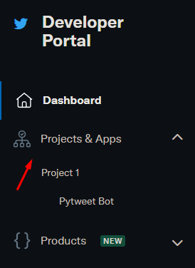
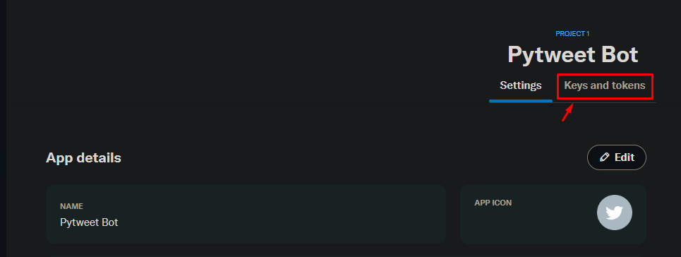
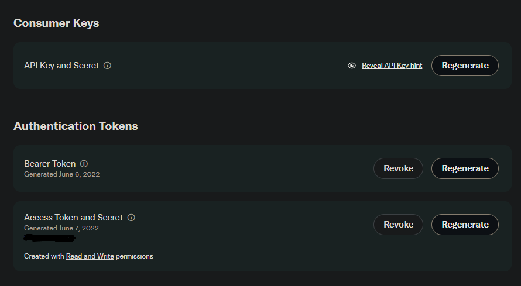
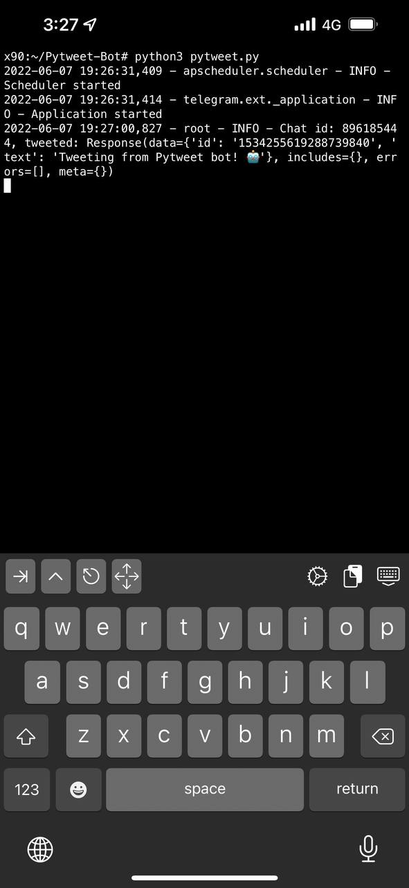
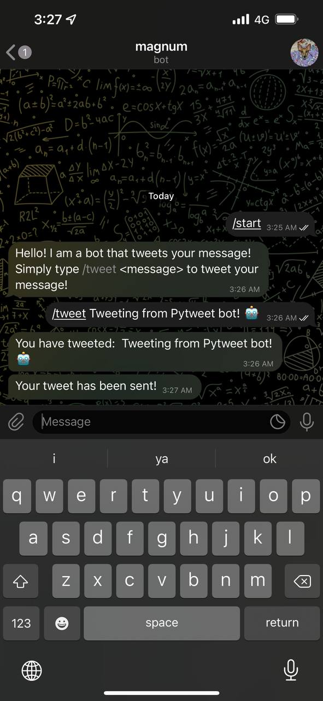

# Pytweet Bot
## Simple python script that allows you to tweet your status using your own telegram bot!

---

## Contents

1. [Installation](#installation)
2. [Usage](#usage)
3. [Examples](#examples)

---

### Installation

Simply clone this repository and run  `pip install -r requirements.txt`

Create a .env file with the following content:

***NOTE: DO NOT share your .env file with others!***

Inside .env, fill in the following tokens
```
TOKEN=<Your Telegram Bot Token>
BEARER_TOKEN=<Your Twitter Bearer Token>

ACCESS_TOKEN=<Your Twitter Access Token>
ACCESS_SECRET=<Your Twitter Access Secret Token>

CONSUMER_KEY=<Your Twitter Consumer Key>
CONSUMER_SECRET=<Your Twitter Consumer Secret Key>
```

To get the tokens, go to https://developer.twitter.com/en/apps and create a new app.



<br>

Click `Keys and tokens`



<br>

Generate the following keys and insert into .env



<br>

Finally run the bot with `python3 pytweet.py`

---

### Usage
```
/start          - Brief explanation of how the bot works
/tweet <status> - Tweet your status. Tweets exceeding 140 characters will be split into multiple tweets. 
                  Each with (TweetNumber) <status>
```

---

### Examples

Running the code



<br>

Entering my tweet in the bot



<br>

Tweet displaying in Twitter


---
